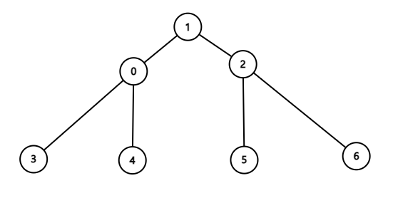

## Diameter of Tree

## 문제

> 가중치를 가지는 트리에서 임의의 두 노드를 선택합니다. 이 때 두 노드를 연결하는 가중치들의 합이 최대가 되는 가중치를 반환하세요.(지름 반환 문제)

## 접근방법

1. 임의의 두 리프 노드를 선택한 집합이 최장 가중치의 후보가 된다.
2. 루트 노드에서 부터 1 depth씩 내려가며 가장 긴 간선을 택해 리프 노드를 찾아가는 Greedy한 방법은 오류가 있다. => 선택되지 않은 노드에서 아래로 연결된 간선이 높은 가중치를 가질 수 있기 때문에.
3. 2번의 이유로 모든 노드를 확인해야 한다.
4. 어느 노드에서라도 가중치들의 합이 최대가 되는 노드를 찾으면 그 노드는 지름이 되는 두 노드 중에 한 노드가 된다.

   - 3번과 6번을 연결하는 가중치들의 합이 지름이라고 가정하자. 0,1,2 노드는 리프 노드가 아니기 때문에 후보 노드에서 제외한다.
   - 그 외에는 4번과 6번을 연결한 경우를 예시로 3번과 6번보다 짧다는 것을 증명하려면, 공유되는 간선인 0번에서 6번까지를 제외한 0번과 3번을 연결한 간선과 0번과 4번을 있는 간선의 가중치를 비교하면 된다.
   - 이때 0번에서 3번을 잇는 간선이 더 커야 3번에서 6번을 잇는 가중치의 합이 최대가 되기 때문에 4번과 6번을 잇는 가중치의 합은 무조건 작은 값이 된다. 나머지 리프노드를 선택해도 모두 같은 원리가 적용된다.

결론적으로, dfs로 모든 노드를 순회한다. 노드를 거쳐갈 때 마다 가중치를 기록해 최대값을 갱신하면 정답을 구할 수 있다.

<div style="text-align:center">
    
    <cite>
        <a href="https://grepp-programmers.s3.amazonaws.com/files/ybm/e7dd4f51c3/a228c73d-1cbe-4d59-bb5d-833fd18d3382.png" target="_black">burglary image</a> by Programmers
    </cite>
</div>

## 코드

그래프를 구성하는 vertex를 class로 선언한다.
adj_list는 vertex에 연결된 vertices들의 index와 weight를 저장한다.

```Python
class Vertex:
    def __init__(self, adj_vertex = None):
        if adj_vertex:
            self.adj_list = [adj_vertex] # [(index, weight)]
        else:
            self.adj_list = []
```

다음으로 vertex들을 관리할 그래프를 클래스를 선언하고, vertex들을 관리할 vertices를 선언한다.

```Python
class Graph:
    def __init__(self, n):
        # 인접행렬 보다 리스트가 유리(트리기 때문에)
        self.vertices = [0] * (n + 1)
```

주어진 정보(vertex )

```Python
def insert(self, v_index, adj_v_index, weight):
    if self.vertices[v_index] == 0:
        self.vertices[v_index] = Vertex((adj_v_index, weight))
    else:
        self.vertices[v_index].adj_list.append((adj_v_index, weight))

    if self.vertices[adj_v_index] == 0:
        self.vertices[adj_v_index] = Vertex((v_index, weight))
    else:
        self.vertices[adj_v_index].adj_list.append((v_index, weight))
```
