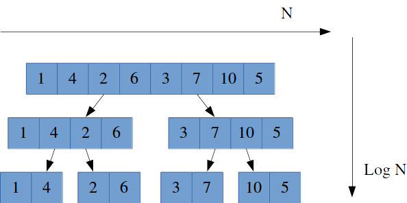

# Jump to Merge Sort

## About Merge Sort

정렬된 두 리스트의 왼쪽 인덱스부터 차례대로 대소관계를 비교합니다. 그리고 비교된 값 중 작은 값 부터 새로운 리스트에 채워나가면 O(n)의 시간복잡도로 두 리스트를 하나의 리스트에 정렬시킬 수 있습니다. 이 방법을 활용해서 정렬되지 않은 하나의 리스트를 길이가 2 혹은 1인 여러 개의 부분 리스트로 분할합니다. 나눠진 부분 리스트들 중에서 두 리스트씩 비교해 하나의 더 큰 정렬된 리스트를 만드는 과정을 반복하면 입력받은 리스트를 정렬할 수 있습니다.

## Process of Merge Sort

1. 리스트를 두 부분의 리스트로 더 이상 나눌 수 없을 때까지 작게 나눕니다.(분할)

2. 길이가 1인 리스트(가장 작은 리스트)가 되면 두 개의 인접한 리스트를 선택해 대소 관계를 비교하고 하나의 정렬된 상태로 합병하여 임시 리스트에 저장합니다.(정복)

3. 임시 리스트에 저장된 값들을 원래 리스트에 할당합니다.(합병)

4. 가장 작은 리스트가 모두 합병되어 조금 더 커진 부분 리스트가 되면 다시 이 리스트들 끼리 1번 부터 3번까지 반복합니다.

## Time Complexity

- 분할 과정: n-1 번 => O(n)
- 정복 과정: n \* log(n) 번 => O(NlogN)
- 합병 과정: n-1 번 => O(n)

알고리즘의 시간복잡도를 측정할 때 정확하게 적용하지 않았기 때문에 시간 복잡도가 왜 O(NlonN)인지 헷갈렸다.
시간복잡도를 계산할 때는 알고리즘에서 가장 복잡한 시간을 정확하게 인지해야 한다.

즉 분할과정과 합병과정 정복과정은 모두 별개로 실행되기 때문에 O(n)번은 모두 무시하고, 정복 과정을 살펴보면 아래 그림과 같이 logN의 깊이 만큼 N번을 비교해야 하기 때문에 시간 복잡도는 O(logN)이 된다.

    
    <cite><a href="https://www.weeklyps.com/entry/%EB%B3%91%ED%95%A9-%EC%A0%95%EB%A0%AC-Merge-sort" target="_black">Merge Big-O Image</a> by RiKang</cite>

## Code

추후 작성 예정입니다.
