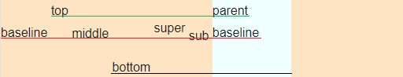

# vertical-align

오늘을 css prop 중 vertical-align에 대해 심플하게 알아보자.

vertical-aline은 mdn에서 display가 **inline, inline-block, table-cell**인 경우에 세로 방향의 line 정렬을 위해 사용할 수 있다고 소개한다. (**즉, block level elements는 사용할 수 없음!**)

그리고 정렬되는 기준이 조금 까다로운데 크게는 아래처럼 두 가지 경우로 정렬 기준을 나눌 수 있다.

- 1. inline(inline, inline-block) elements: 해당 elements를 포함하는 line box가 기준이 된다.
- 2. table cell: 해당 cell이 기준이 된다.

이 중에 오늘은 **inline elements**에 대해서 알아볼 것이다.

## vertical align의 Values

vertical align에는 다양한 value를 지정할 수 있는데,
value에 따라서 부모 요소에 영향을 받는 것과, line box에 영향을 받는 value로 분류된다.

### Values for inline elements

#### Parent-relative values

아래의 값들은 정렬시 부모 요소에 영향을 받는다.

- baseline(기준선): 해당 요소의 기준선을 부모 요소의 baseline으로 정렬한다. 단, textarea같은 몇몇의 [replaced elements](https://developer.mozilla.org/en-US/docs/Web/CSS/Replaced_element)는 browser에 따라 baseline의 위치가 HTML 표준에 명세되어 있지 않기 때문에 주의해야 한다.
- sub: 해당 요소의 기준선을 부모 요소의 subscript-baseline(baseline보다 약간 아래)을 기준으로 정렬한다.
- super: 해당 요소의 baseline을 부모 요소의 superscript-baseline(baseline보다 약간 위)을 기준으로 정렬한다.
- text-top: 해당 요소의 top을 부모 요소 font의 top으로 정렬한다.(글꼴 중 가장 큰 철자 맨 위에 맞추어 정렬.)
- text-bottom: 해당 요소 & 부모 요소 font의 bottom을 기준으로 정렬한다.
- middle: 부모 요소의 baseline을 기준으로 x-height(소문자 x의 height)의 1/2이 기준이 된다.
- length: 부모 요소의 기준선에서 length 길이 만큼 위쪽으로 떨어진 위치가 해당 요소의 기준선이 된다. 따라서 0 이하의 값도 입력 가능.

#### Line-relative values

아래의 값들은 Line에 영향을 받는다.

- top: 요소와 자식요소를 포함하여 전체 라인의 가장 위 라인이 기준이 된다.(line box의 최상단)
- bottom: 요소와 자식요소를 포함하여 전체 라인의 가장 위 라인이 기준이 된다.(line box의 최하단)

> baseline이 없는 경우 bottom margin이 baseline이 된다.

#### test

```html
<p
  style="
    background: bisque;
"
>
  <span>baseline</span>
  <span style="vertical-align: top">top</span>
  <span style="vertical-align: middle">middle</span>
  <span style="vertical-align: bottom">bottom</span>
  <span style="vertical-align: super">super</span>
  <span style="vertical-align: sub">sub</span>
  <span
    style="
    display: inline-block;
    height: 100px;
    width: 100px;
    background: azure;
"
    >test inline element</span
  >
</p>
```

<div style="text-align:center">
    
</div>

1. 부모의 라인은 parent와 baseline이 있으며 가장 아래쪽에 위치한 baseline이 부모의 baseline이 된다.
2. 자식의 baseline은 부모의 baseline을 따르기 때문에 두 baseline이 일치한다.
3. top의 경우 line을 기준으로 가장 위쪽의 line인 parent가 기준선이 된다.
4. bottom의 경우 line box의 최하단이 기준이 되었음을 알 수 있다.(line box가 계산되는 기준은 여라가지가 있지만 그 중에 inline-level 요소들의 높이를 계산하여 가장 큰 값을 가져오게 된다.)

### reference

- vertical-align: https://developer.mozilla.org/en-US/docs/Web/CSS/vertical-align
