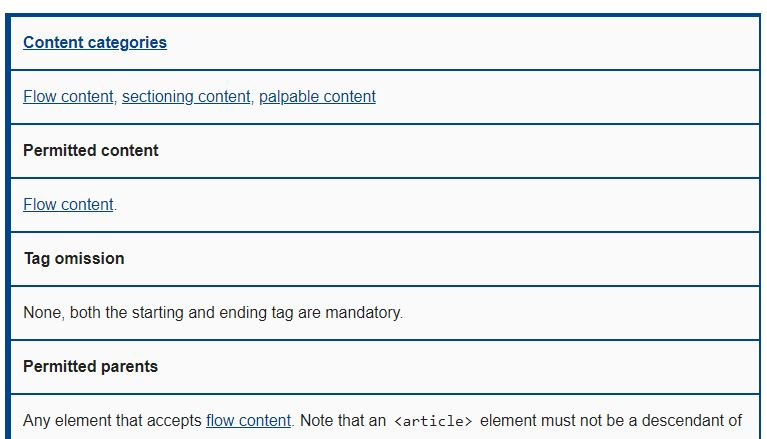

HTML5는 HTML 4.01과 XHTML 1.0 문법을 모두 반영합니다. 이와 더불어 기존에 없던 콘텐츠 모델이라는 개념이 도입되었는데, 오늘은 콘텐츠 모델에 대해서 알아보려고 합니다.

## 1. Content models

모든 요소는 콘텐츠 모델이라는 개념을 가지고 있습니다. 그렇다면 콘텐츠 모델이란 무엇일까요? 각 요소는 고유의 의미를 가지고 있습니다. 예를 들어 article은 독립적으로 존재할 수 있는 내용을 담고있죠. 그래서 이 요소의 내부에는 보통 내용의 주제를 의미할 h 태그를 사용합니다. 이 처럼 각 요소는 모두 고유한 의미를 가지고 있기 때문에 포함할 수 있는 요소가 있을 것이고, 반대로 그렇지 못하는 요소도 존재하겠죠.

그런데 html에 정의된 모든 요소들 마다 어떤 요소를 사용할 수 있는지 하나하나 판단하는게 쉬울까요? 할 수는 있지만 꽤나 복잡한 일거리가 될 거에요. 그래서 HTML5에서는 비슷한 성격의 요소들을 묶어서 총 7개의 카테고리로 분류했어요. 이제 각 요소가 어떤 카테고리를 사용할 수 있는지만 알면 비교적 쉽게 사용가능한 요소를 파악할 수 있겠죠. 여기서 카테고리로 분류된 것들이 바로 콘텐츠 모델이라는 개념입니다.

    
    <cite>
        <a
        href="https://developer.mozilla.org/en-US/docs/Web/HTML/Element/article" target="_blank">a tag of article's content categories</a> by MDN
    </cite>

## 7가지 콘텐츠 모델

### 1. Metadata content

### 2. Flow content

### 3. Sectioning content

### 4. Heading content

### 5. Phrasing content

### 6. Embedded content

### 7. Interactive content

### 참고문서

- [w3c-working-draft](https://www.w3.org/TR/2011/WD-html5-20110525/content-models.html)
