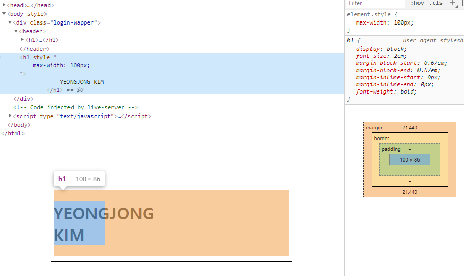

# Today I learned

오늘은 max-width 속성에 대해 알아보았다.
max-width 속성은 inline, block 요소와 무관하게
모든 요소에 대해서 width 값의 maximum을 설정한다.

inline요소와 block요소에 따른 차이점은
block 요소는 기본적으로 가로를 모두 채우고있기 때문에 width에 여백이 생긴 경우라면 남은 여백을 margin으로 채우는 특징이 있다.

