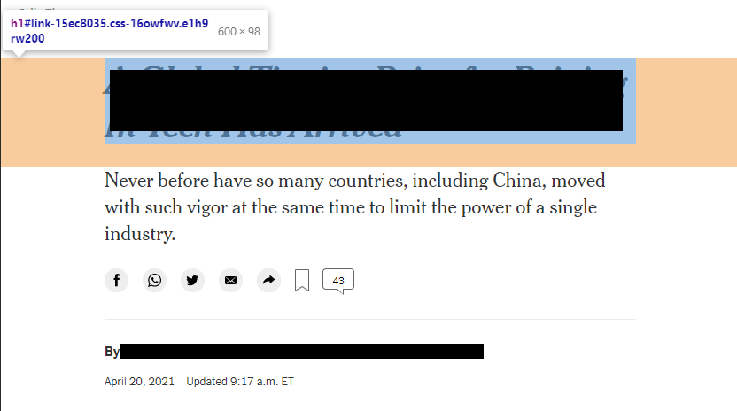

# 왜 h1 태그를 로고에 사용하는가?

페이지의 h1태그를 로고와 함께 사용하는 케이스를 자주 접할 수 있습니다. 그러다 문득 왜 h1 태그를 관례처럼 로고와 함께 사용하고 있는지 의문이 들었습니다. 그래서 오늘은 마크업 구조에서 왜 h1 태그를 로고와 함께 사용하고 있는지 알아보려고 합니다.

## 내 생각

1. h1 태그는 페이지를 대표하는 가장 큰 제목입니다. 기업을 대표하는 로고는 header 영역내에서 그 무엇보다 필수로 삽입되어야하는 요소로, 큰 제목이 될 수 있습니다.
2. 접근성 측면에서 h1 태그를 홈 버튼으로 생각하는 사용자가 많습니다.
3. SEO 알고리즘이 중요하게 여기는 요소는 title 다음으로 h1 태그입니다. 이미 잘 알려진 기업의 경우 로고의 이름을 검색하는 경우가 대부분이기 때문에 h1 태그를 로고와 함께 배치하는 것이 유리합니다.

## KWAG(Korea Web Accessbility Group)를 참고한 내용

주로 컨텐츠, SEO, 접근성 이 세가지 관점을 기준으로 어떤 관점을 더 높이 생각하는지에 따라 의견이 갈렸습니다.

### 컨텐츠

일반적으로 사용자의 입장에서 문서상의 로고를 주요한 컨텐츠로 생각하는 사람은 거의 없다. 단순한 이미지 정도로 생각하기 때문에 모든 페이지마다 로고를 h1과 함께 배치하는 것은 좋은 방법이 아니다. 따라서 페이지의 가장 중요한 컨텐츠의 제목을 h1으로 배치하는 것이 의미상으로 가장 적합하다.

### SEO

검색 최적화 및 상단 노출을 위해 컨텐츠 영역의 제목을 h1태그와 함께 배치하는 것이 유리할 수 있다. 실제로 뉴욕 타임즈의 기사는 기사 제목을 h1으로 지정하고 있다.

    
    <cite>
        <a href="https://www.nytimes.com/2021/04/20/technology/global-tipping-point-tech.html" target="_black">article</a> by NYT
    </cite>

### 접근성

로고를 h1으로 제작된 웹페이지들이 많다. 사용자는 h1을 이미 로고로서 인식하고 있는 경우가 있는데, 특히 스크린리더를 사용하는 경우 이러한 사용자 경험이 두드러진다.

## 참고자료:

[로고와 h1](https://m.blog.naver.com/PostView.nhn?blogId=messinger00&logNo=220102956443&proxyReferer=https:%2F%2Fwww.google.com%2F)
