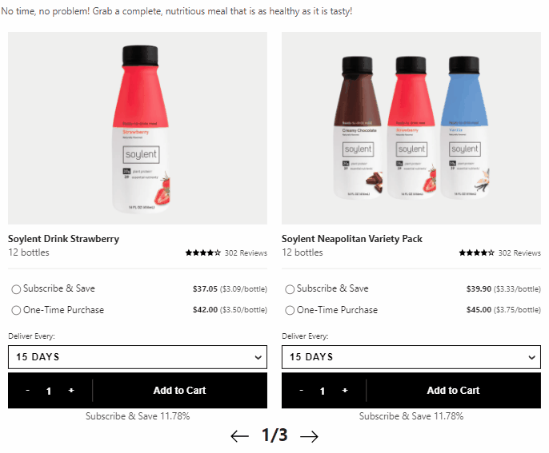
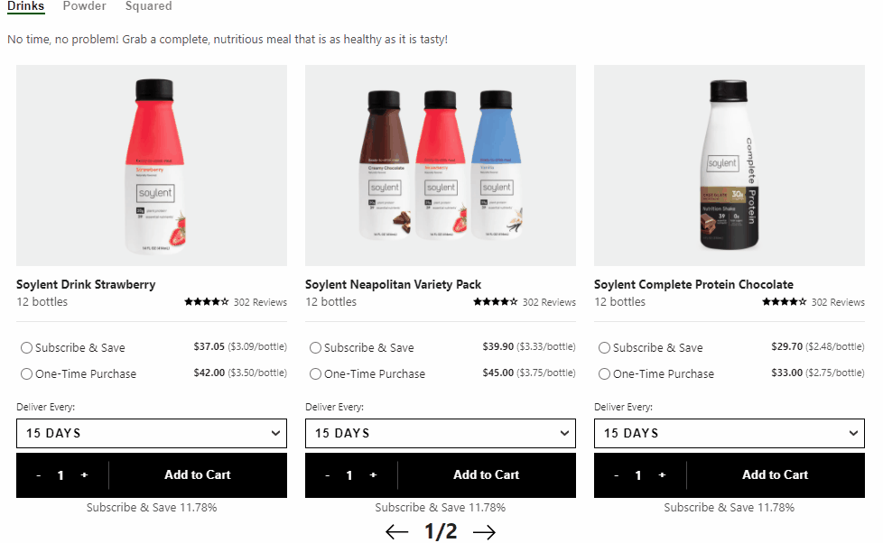
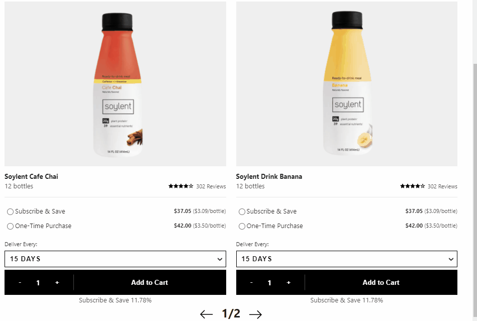
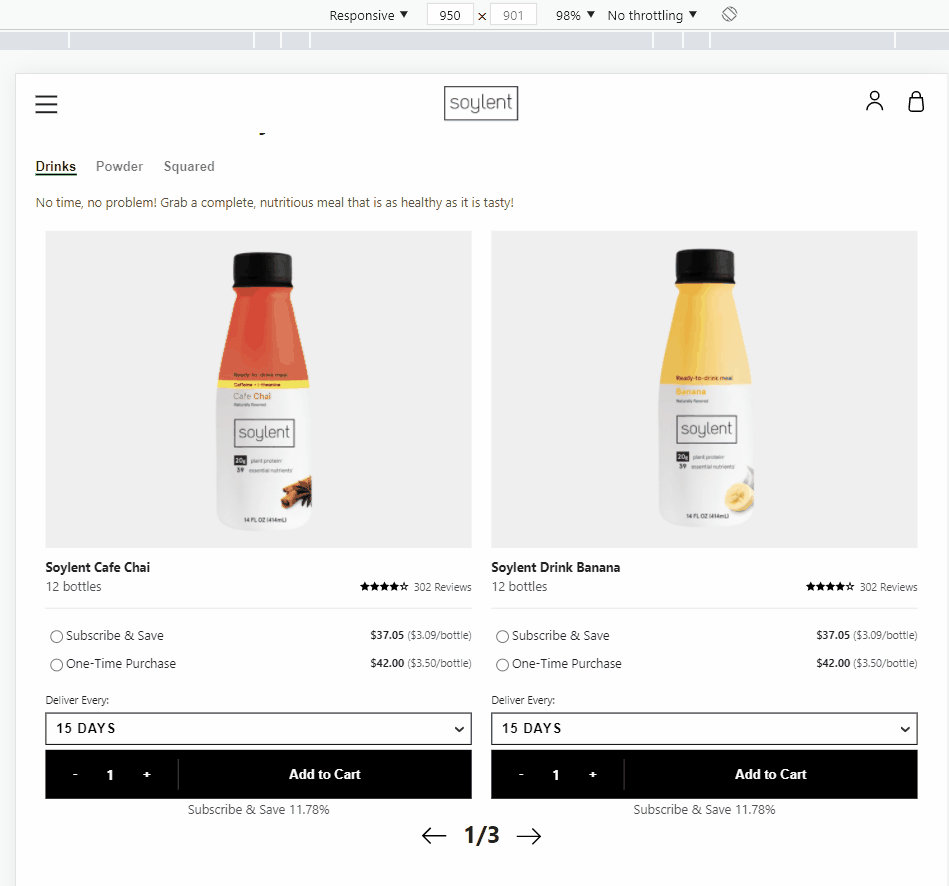

# web API가 제공하는 여러가지 width 값에 대해서

이번에 반응형으로 slick(carousel)을 구현하며 겪은 문제가 있다.
브라우저의 크기가 변경되면 slick이 한 화면에 보여주는 슬라이드의 수가 유동적으로 변하게 되는데,
slick은 마지막 페이지에 도달하면 다음 페이지로 이동하지 못하게 막아야하므로
다음 처럼 총 6개의 슬라이드가 있다고 가정한다면
2개의 슬라이드씩 넘어갈 때는 3번을 넘길 수 있지만, 3개의 슬라이드가 넘어갈 때는 2번만 넘어가도록 만들어야 했다.

**예시**

- 2 slides on one page

  <div style="text-align:center">
      
  </div>

- 3 slides on one page

  <div style="text-align:center">
      
  </div>

## 문제점

본인은 screen.window.availWidth를 사용해 구현했고 availWidth를 사용했을 때 아래와 같이 문제가 있었다.

1. 브라우저(윈도우)의 크기에 따라서 slick의 전체 page 수가 변동되어야 하는데, 변하지 않았다. 슬라이드의 개수가 3개일 때 1/2로 표기되는 것은 옳지만, 슬라이드의 개수가 2개일 떄는 1/3으로 표기되어야 정상이다. 하지만 아래 처럼 1/2로 고정되어있음을 알 수 있다.

<div style="text-align:center">
  
</div>

2. devTools에서 해상도를 변경할때는 정상적으로 page 수가 변동된다.

<div style="text-align:center">
  
</div>

왜 이 같은 문제가 발생하는지 찾아보았고 그 해답은 web api의 특성에 있었다.

## web APIS

1. window.screen.width

window.screen.width는 모니터의 해상도이다. 따라서 노트북, 모바일 등 해상도가 다른 디바이스마다 값이 다르다.

하지만 같은 디바이스에서는 **죽었다 깨어나도 값**이 바뀔일이 없다.

2. window.screen.availWidth

본인이 햇갈렸던 api다. api 이름으로만 보면 브라우저의 크기에 따라 그 값이 변동되는 것처럼 느껴지지만 실상은 그렇지 않다.

window.screen.width와 성질은 같다. 역시나 모니터 해상도에 따라 값이 정해지며, 다만 상단의 툴바와 같은 영역을 제외하고 screen size가 결정된다. 주의할 점은 **브라우저의 크기를 줄여도** 무조건 **모니터의 해상도**가 기준이 되어 툴바 영역을 배제한다는 점이다.

- 툴바를 제외하는 window.screen.availHeight와 window.screen.height의 예시

```js
console.log(
  'availHeight: ',
  window.screen.availHeight,
  'height: ',
  window.screen.height
); // availHeight: 1050 height: 1080
```

3. window.innerWidth

innerWidth는 브라우저 윈도우 창틀(외부 영역)을 제외한 크기를 표시한다. 반대로 window.outerWidth는 창틀까지 포함한 영역을 크기다.

## slick에 적용할 web API는?

디바이스의 크기가 아니라 브라우저의 크기에 따라 slide의 개수가 정해지기 때문에, window.innerWidth를 사용해야 한다.

## 구현

React에서 커스텀 훅에 window.innerWidth를 사용해 봤다.
resize 이벤트는 window의 크기가 변할 때 트리거 된다. resize 이벤트와 window.innerWidth를 함께 사용하면 문제를 해결할 수 있다.

```js
import { useEffect, useState } from 'react';

export default function useWindowWidth() {
  const [windowWidth, setWindowWidth] = useState(window.innerWidth);

  useEffect(() => {
    window.addEventListener('resize', () => {
      setWindowWidth(window.innerWidth);
    });
  }, [windowWidth]);

  return windowWidth;
}
```
