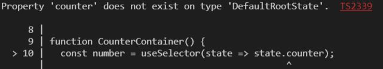
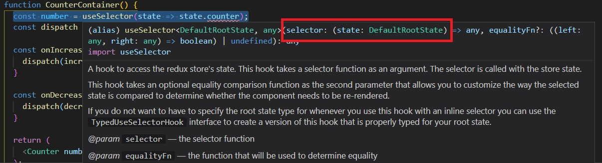

# Jump into Redux with typescript

리덕스를 typescript로 작성해보자!
모든 내용은 [redux 홈페이지](https://redux.js.org/usage/usage-with-typescript)를 참고했다. 매우 친절하게 설명되어 있으니 읽어보는 것을 왕왕 추천함!

📒 What we'll learn?

- typescript로 Redux를 작성하는 표준 패턴!
- Redux 로직에서 올바르게 타입을 지정하는 방법

🧠 PREREQUISITES

- 당연하지만 이 챕터를 학습하기 위해서는 ts 문법과 용어를 알고 있어야 한다.
- 특히 ts의 generic과 utility type에 대해 알고 있어야 한다.
- 리액트 훅은 필수!

## Overview

리덕스를 타입스크립트와 함께 사용했을 때 얻을 수 있는 장점을 아래와 같다.

1. reducer, state, action creator, UI 컴포넌트 까지 전반적으로 타입오류에 대한 걱정을 줄일 수 있다.
2. 리펙토링이 쉬워진다.
3. A superior developer experience in a team environment (무슨 의미일지 실제로 팀에 소속되어 프로젝트 경험을 해봐야 알 것 같다.)

그러나... 언제나 트레이드 오프는 있는법! 타입에 대한 고민, 코드량 증가, 타입 로직에 의한 코드 복잡도 증가 등 typescript를 적용하는 것은 생각보다 많은 비용이 소모된다. 따라서 프로젝트의 성격에 맞추어 ts를 적용할지 고민할 필요는 있다.

그럼에도 불구하고, Redux에서는 typescript를 절적하게 사용하면 분명히 큰 이점이 있다며 권장하고 있기에 이제 본격적으로 Redux 공식홈페이지에서 제공하는 typescript 표준 패턴에 대해 알아보자!

## Standard Redux Toolkit Project Setup with TypeScript

Redux Toolkit(이하 RTK)은 기존 reducer, actionType, actionCreator 등등을 반드시 작성해야 했던 Redux의 복잡한 로직을 간편하게 만들어주며 이는 Redux 로직의 표준으로 자리잡았다.

Redux Toolkit은 이미 TypeScript로 작성되어있다. 따라서 단순하게 라이브러리를 가져다 사용하는 것을 넘어 타입에 대한 hint를 제공하고 있기 때문에 이를 참조하여 작성해 보자. 보다 쉬운 개발 경험을 제공할 것이니...!

react-redux 또한 `@types/react-redux`라는 별도의 라이브러리로 타입에 대한 정의를 제공하고 있다. react-redux 7.2.3 버전부터 dependency로 함께 설치된다고 하니 그 이하 버전을 사용할 경우에는 수동으로 설치할 필요가 있다.

### Define Root State and Dispatch Types

useSelector를 사용하면서 오류가 발생했다.

```ts
const number = useSelector(state => state.counter);
```



Property 'counter'가 type DefaultRootState에 존재하지 않는다고 한다.

이때 useSelector의 hint를 확인해 보자.



첫번째 매개변수로 입력되는 selector의 경우 state라는 매개변수를 콜백함수를 입력해야 하는데, 이때 state의 type이 DefaultRootState라고 되어있다. 이는 제네릭 문법으로, 위 이미지의 `useSelector<DefaultRootState, any>`부분을 참고하면 useSelector의 제네릭으로 DefaultRootState를 지정하였으며, 함수 내부에서 state가 그 타입을 받고 있음을 확인할 수 있다.

> 참고: generic이란? 타입이 string, number처럼 고정된 타입이 아니라 호출이 될 때 경우에 따라 타입이 바뀌어야 하면 위와 같이 제네릭을 문법을 사용하여 호출시에 type을 설정한다.
> (예제로 queue같은 경우 string Queue, number Queue 다양하게 사용될 수 있으며 제네릭을 사용하면 코드량을 줄일 수 있다.)


심지어 hint를 조금 내려보면 어떻게 사용해야하는지도 알려준다.

[공식문서](https://redux.js.org/usage/usage-with-typescript#define-root-state-and-dispatch-types)에도 자세하게 나와있으니 참고하길 바라며 아래와 같이 타입을 지정하여 문제를 해결하였다.

```js
// index.tsx
const store = configureStore({
  reducer: rootReducer,
});

export type RootState = ReturnType<typeof store.getState>;
```

```js
// CounterContainer.tsx
const useAppSelector: TypedUseSelectorHook<RootState> = useSelector

function CounterContainer() {
  // const number = useSelector<RootState>(state => state.counter);
  const number = useAppSelector(state => state.counter);
```
